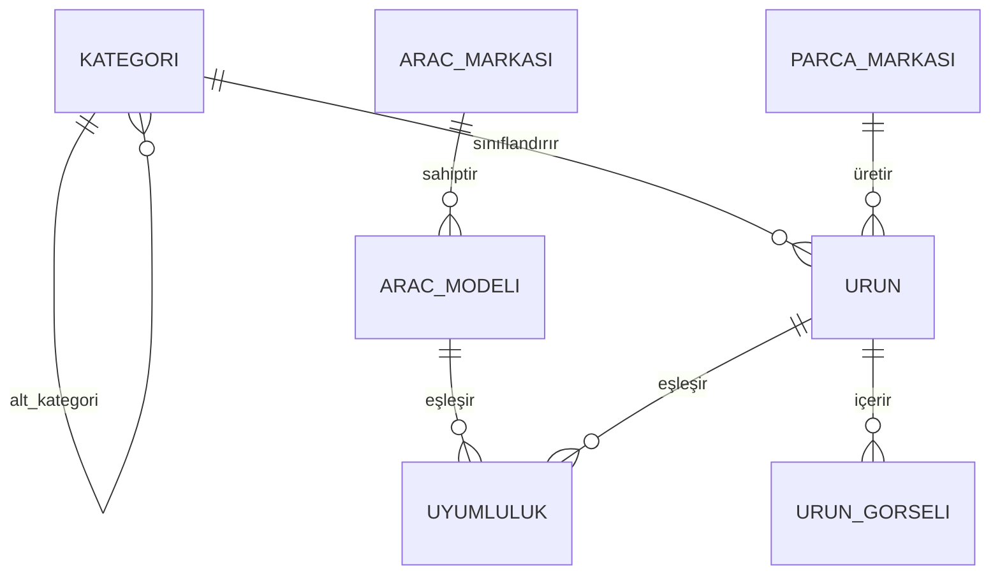

# Veritabanı Şeması — Ürün Kataloğu

Bu belge, `catalog` uygulamasının Faz 2'sinde (bkz. `PLAN.md`) hayata
geçirilecek veritabanı modellerinin tasarımını içerir. Henüz `models.py`'ye
işlenmedi — bu, o çalışmanın önce üzerinde anlaşılacak taslağıdır.

## Gezinme Akışı

**Kategori** ve **Araç Modeli**, bir **Ürün**'ü birlikte süzen iki **bağımsız
eksendir**: `Product.kategori` doğrudan bir FK, araç uyumluluğu ise ayrı bir
**Uyumluluk** ara tablosu üzerinden kurulu. İkisi de `Product`'a birbirinden
habersiz, paralel yollarla bağlandığı için ziyaretçi **hangisiyle önce
başlarsa başlasın** aynı sonuca ulaşır — şema tarafında bunun için ek bir
alan/tablo gerekmez, sadece iki farklı sorgu sırası:

```
Ürünler sayfası
   │
   ├─▶ (A) Önce Kategori seçilir        (ör. "Direksiyon Sistemi")
   │        └─▶ Araç Markası seçilir    (ör. "Toyota")
   │              └─▶ Araç Modeli seçilir     (ör. "Corolla")
   │
   └─▶ (B) Önce Araç Markası seçilir    (ör. "Toyota")
            └─▶ Araç Modeli seçilir     (ör. "Corolla")
                  └─▶ Kategori seçilir  (ör. "Direksiyon Sistemi")
                                              │
                                              ▼
                     Her iki yol da aynı yerde birleşir:
                     O kategori + o modele uyumlu Parçalar listelenir
```

Aynı fiziksel parça (ör. belirli bir fren balatası) genellikle birden fazla
modele/markaya uyduğu için ürün ile araç modeli arasındaki ilişki
**çoktan-çoğa** kuruldu; bunu tek bir sabit alanla değil, ayrı bir
**Uyumluluk** tablosuyla temsil ediyoruz — bu tasarım zaten (A) ve (B)
yollarının ikisini de aynı anda desteklemenin ön koşulu.

## Varlıklar (Entities)

### 1. Kategori (`Category`)

Parça kategorileri (Direksiyon Sistemi, Fren Sistemi, Motor Parçaları,
Süspansiyon, Elektrik Aksamı, Kaporta, vb.). Alt kategori açmak isterseniz
diye kendine referans veren `ust_kategori` alanı eklendi (ör. "Fren Sistemi"
→ "Fren Balatası", "Fren Diski").

| Alan | Tip | Açıklama |
|---|---|---|
| `id` | PK | |
| `ad` | `CharField`, **çok dilli** | "Direksiyon Sistemi" — bkz. [Çok Dilli İçerik](#çok-dilli-i̇çerik-ad--aciklama) |
| `slug` | `SlugField`, unique | URL için |
| `ust_kategori` | `ForeignKey('self')`, null=True, blank=True | Alt kategori desteği |
| `aciklama` | `TextField`, blank=True, **çok dilli** | |
| `gorsel` | `URLField` / Cloudinary alanı, blank=True | Kart görseli |
| `sira` | `PositiveIntegerField`, default=0 | Kartların gösterim sırası |

### 2. Araç Markası (`VehicleBrand`)

Toyota, Ford, Renault, Fiat, Volkswagen vb. — **aracın** markası; parçanın
kendi üretici markasıyla (Bosch, Mann Filter vb.) karıştırılmamalı, bkz.
[Ek Notlar](#ek-notlar-ve-opsiyonel-genişletmeler).

| Alan | Tip | Açıklama |
|---|---|---|
| `id` | PK | |
| `ad` | `CharField`, unique | "Toyota" |
| `slug` | `SlugField`, unique | |
| `logo` | `URLField` / Cloudinary alanı, blank=True | |

### 3. Araç Modeli (`VehicleModel`)

| Alan | Tip | Açıklama |
|---|---|---|
| `id` | PK | |
| `marka` | `ForeignKey(VehicleBrand)` | |
| `ad` | `CharField` | "Corolla" |
| `slug` | `SlugField` | (marka, slug) birlikte unique |
| `uretim_baslangic_yili` | `PositiveIntegerField`, null=True, blank=True | Opsiyonel — nesil ayrımı için |
| `uretim_bitis_yili` | `PositiveIntegerField`, null=True, blank=True | Opsiyonel |

### 4. Parça Markası (`PartBrand`)

Bosch, Valeo, Mann Filter, TRW vb. — **parçanın kendi** üretici markası;
Araç Markası (`VehicleBrand`, §2) ile karıştırılmamalı: o aracın markası,
bu ise parçayı üretenin markası. Artık `Product` üzerinde düz bir metin
alanı değil, kendi tablosu var (bkz. [Ek Notlar](#ek-notlar-ve-opsiyonel-genişletmeler)).

| Alan | Tip | Açıklama |
|---|---|---|
| `id` | PK | |
| `ad` | `CharField`, unique | "Bosch" |
| `slug` | `SlugField`, unique | |
| `logo` | `URLField` / Cloudinary alanı, blank=True | |

### 5. Ürün / Parça (`Product`)

| Alan | Tip | Açıklama |
|---|---|---|
| `id` | PK | |
| `kategori` | `ForeignKey(Category)` | Parçanın sınıfı |
| `parca_markasi` | `ForeignKey(PartBrand, null=True, blank=True, related_name='urunler')` | Parçanın üretici markası — bkz. §4 |
| `ad` | `CharField`, **çok dilli** | "Ön Fren Balatası Takımı" — bkz. [Çok Dilli İçerik](#çok-dilli-i̇çerik-ad--aciklama) |
| `slug` | `SlugField`, unique | |
| `parca_numarasi` | `CharField`, unique, db_index=True | SKU / OEM parça no — bu sektörde aramanın çoğu bununla yapılır |
| `aciklama` | `TextField`, blank=True, **çok dilli** | |
| `fiyat` | `DecimalField(max_digits=10, decimal_places=2)` | |
| `stok_adedi` | `PositiveIntegerField`, default=0 | |
| `ana_gorsel` | `URLField` / Cloudinary alanı | Kart üzerindeki görsel |
| `aktif_mi` | `BooleanField`, default=True | Yayından kaldırma için soft-disable |
| `olusturulma_tarihi` | `DateTimeField(auto_now_add=True)` | |
| `guncellenme_tarihi` | `DateTimeField(auto_now=True)` | |
| `uyumlu_modeller` | `ManyToManyField(VehicleModel, through='Uyumluluk')` | §7'deki ara tablo üzerinden |

`parca_markasi` neden `null=True`: bazı jenerik/markasız parçalarda üretici
markası bilinmeyebilir veya belirtilmek istenmeyebilir; zorunlu tutmadık.

### 6. Ürün Görseli (`ProductImage`) — opsiyonel galeri

Ürün detay sayfasında tek görselden fazlası gerekirse:

| Alan | Tip | Açıklama |
|---|---|---|
| `id` | PK | |
| `urun` | `ForeignKey(Product, related_name='gorseller')` | |
| `gorsel` | `URLField` / Cloudinary alanı | |
| `sira` | `PositiveIntegerField`, default=0 | |

### 7. Uyumluluk (`Fitment`) — Ürün ↔ Araç Modeli ara tablosu

Gezinme akışının son adımını ("bu modele uyan parçalar") ve çoktan-çoğa
ilişkiyi kuran asıl tablo.

| Alan | Tip | Açıklama |
|---|---|---|
| `id` | PK | |
| `urun` | `ForeignKey(Product, related_name='uyumluluklar')` | |
| `arac_modeli` | `ForeignKey(VehicleModel, related_name='uyumluluklar')` | |
| `yil_baslangic` | `PositiveIntegerField`, null=True, blank=True | Modelin belirli bir üretim aralığına daraltmak için (opsiyonel) |
| `yil_bitis` | `PositiveIntegerField`, null=True, blank=True | |

`unique_together = ("urun", "arac_modeli", "yil_baslangic", "yil_bitis")`

## İlişki Diyagramı



## Gezinme Adımlarının Sorgu Karşılıkları

### Yol A — Önce Kategori

```python
# 1) Ürünler sayfası — üst seviye kategori kartları
Category.objects.filter(ust_kategori__isnull=True).order_by("sira")

# 2) Kategori seçildi → bu kategoride (en az bir) parçası olan markalar
VehicleBrand.objects.filter(
    modeller__uyumluluklar__urun__kategori=secilen_kategori
).distinct()

# 3) Marka seçildi → bu marka + kategoride parçası olan modeller
VehicleModel.objects.filter(
    marka=secilen_marka,
    uyumluluklar__urun__kategori=secilen_kategori,
).distinct()

# 4) Model seçildi → o kategoride, o modele uyumlu parçalar
Product.objects.filter(
    kategori=secilen_kategori,
    uyumluluklar__arac_modeli=secilen_model,
    aktif_mi=True,
)
```

### Yol B — Önce Araç Markası

`Category` hiç devreye girmeden, tamamen bağımsız başlayabilir:

```python
# 1) Ürünler sayfası — tüm markalar (kategoriden bağımsız, doğrudan liste)
VehicleBrand.objects.all()

# 2) Marka seçildi → bu markanın modelleri
VehicleModel.objects.filter(marka=secilen_marka)

# 3) Model seçildi → bu modele uyumlu parçası olan kategoriler
Category.objects.filter(
    urunler__uyumluluklar__arac_modeli=secilen_model
).distinct()

# 4) Kategori seçildi → o kategoride, o modele uyumlu parçalar
#    (Yol A'daki 4. adımla birebir aynı sorgu — iki yol aynı yerde birleşiyor)
Product.objects.filter(
    kategori=secilen_kategori,
    uyumluluklar__arac_modeli=secilen_model,
    aktif_mi=True,
)
```

İki yolun 4. adımı **tamamen aynı sorgu** — hangi sırayla filtrelenirse
filtrelensin, sonuçta `kategori=X AND uyumlu_model=Y` koşulunu sağlayan
`Product` kayıtları listeleniyor. Bu yüzden arayüzde "önce marka" veya "önce
kategori" seçeneklerinin ikisini birden sunmak sadece bir **UI/view**
kararı; veritabanı şemasında herhangi bir değişiklik gerektirmiyor.

## Çok Dilli İçerik (`ad` / `aciklama`)

Şablonlardaki sabit metinler (``) site genelinde 5 dili (tr, en,
fr, es, ar) zaten destekliyordu, ama bu **veritabanına girilen içeriği**
kapsamıyor — admin'den yazılan bir ürün açıklaması, gettext'in çeviremeyeceği
saf veridir. Bunun için `Category.ad`/`aciklama` ve `Product.ad`/`aciklama`
alanları **`django-modeltranslation`** ile çok dilli yapıldı:

- Arka planda her alan için dil başına gerçek bir kolon oluşuyor:
  `ad_tr`, `ad_en`, `ad_fr`, `ad_es`, `ad_ar` (aynı şekilde `aciklama_*`).
- Kod/şablon tarafında hiçbir şey değişmiyor — `kategori.ad` veya
  `urun.aciklama` yazmaya devam edersiniz; modeltranslation bunu o anki
  aktif dile (`LocaleMiddleware`'in belirlediği dile) göre otomatik olarak
  doğru kolona yönlendirir.
- Bir dil için çeviri girilmemişse **varsayılan dile (tr) düşer** (boş
  görünmez) — bu davranış test edildi ve doğrulandı.
- Admin panelinde `Category` ve `Product` için dil sekmeleri
  (`TabbedTranslationAdmin`) görünür; her dile ayrı ayrı içerik girilir.
- `VehicleBrand.ad`, `VehicleModel.ad`, `PartBrand.ad` **kasıtlı olarak çok
  dilli yapılmadı** — "Toyota", "Corolla", "Bosch" gibi özel isimler her
  dilde aynı kalır, çevrilmesi anlamsız olurdu.
- Yeni bir dil eklemek isterseniz: `settings.py`'deki `LANGUAGES` ve
  `MODELTRANSLATION_LANGUAGES` listelerine ekleyip `makemigrations` +
  `migrate` çalıştırmak yeterli (yeni dil için otomatik olarak yeni kolonlar
  açılır).

## Ek Notlar ve Opsiyonel Genişletmeler

- **İki farklı "marka" var, ikisi de artık kendi tablosunda:**
  `VehicleBrand` (§2) **aracın** markası (Toyota, Ford — gezinme
  hiyerarşisinin parçası); `PartBrand` (§4) ise **parçanın kendi** üretici
  markası (Bosch, Mann Filter — bilgi/filtreleme amaçlı, gezinme
  hiyerarşisine dahil değil). İkisi ayrı tablolar olduğu için birbirine
  karışmaz ve `PartBrand` ileride "markaya göre filtrele" gibi bir ürün
  listesi filtresine de kolayca bağlanabilir (`Product.parca_markasi`
  üzerinden `PartBrand.urunler`).
- **Yıl/nesil ayrımı** `VehicleModel` ve `Fitment` üzerinde opsiyonel
  bırakıldı. Kullanmak istemezseniz bu alanları boş geçmek yeterli; ileride
  "2014 öncesi / sonrası farklı parça" ihtiyacı çıkarsa zaten hazır.
- **Alt kategori** desteği (`ust_kategori`) bugün kullanılmasa da modelde
  hazır; kullanmak istemezseniz hepsini üst seviyede (ust_kategori=None)
  bırakmanız yeterli, ekstra bir şey yapmanız gerekmez.
- Görsel alanları `URLField` olarak belirtildi çünkü proje Cloudinary
  kullanıyor (bkz. `README.md`); doğrudan medya dosyası saklanmayacak.

## Kapsam Dışı (bu şemada yok)

Sipariş/sepet, kullanıcı hesabı, ödeme gibi e-ticaret akışları bu şemaya
dahil edilmedi — `README.md`'de belirtildiği gibi bu aşamanın hedefi
katalog/vitrin, tam e-ticaret değil.
